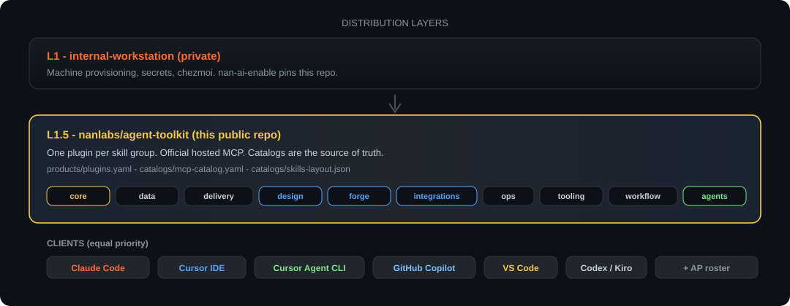

<div align="center">

<picture>
  <source media="(prefers-color-scheme: dark)" srcset="static/hero-banner.svg">
  <source media="(prefers-color-scheme: light)" srcset="static/hero-banner.svg">
  
</picture>

# agent-toolkit

### NaNLABS skills, agents, and plugins — L1.5 distribution

<p><strong>Claude · Claude Code · Cursor IDE · Cursor Agent CLI</strong> — equal product priority</p>

<p>
  <a href="docs/README.md">Docs</a> ·
  <a href="docs/wiki/Home.md">Wiki source</a> ·
  <a href="docs/ADOPTION.md">Adoption</a> ·
  <a href="docs/SCOPE.md">Scope</a> ·
  <a href="CONTRIBUTING.md">Contributing</a>
</p>

<br>

<p>
  <a href="https://github.com/nanlabs/agent-toolkit/actions/workflows/validate.yml"></a>
  <a href="https://github.com/nanlabs/agent-toolkit/actions/workflows/mega-linter.yml"></a>
  <a href="https://agentskills.io/specification"></a>
  <a href="LICENSE"></a>
</p>

<p>
  
  
  
  
</p>

<p>
  
  
  
  
</p>

</div>

---

## What is agent-toolkit?

Public **L1.5** distribution of NaNLABS AI capabilities: Agent Skills, agent personas, and Claude/Cursor marketplace plugins. Machine provisioning stays in [`internal-workstation`](https://github.com/nanlabs/internal-workstation) (L1).

Smaller than multi-tool personal forks: **no** consumer CLI, loop runtime, or OpenCode/Copilot/Windsurf/Gemini/Pi plugin targets. Portable skills may still work via `npx skills`.

<div align="center">
  
</div>

## Highlights

- **Equal-priority surfaces** — Claude, Claude Code, Cursor IDE, and Cursor Agent CLI
- **Recommended plugin** — `nanlabs-core` with bundled setup (`/nanlabs-core:setup`)
- **Optional roster** — `nanlabs-agents` for all 16 personas
- **Honest MCP** — templates under `mcp/templates/` are docs-only
- **CI quality bar** — manifests, skills-ref, Claude validate, MegaLinter, Danger

## Quick install

### Claude Code

```text
/plugin marketplace add nanlabs/agent-toolkit
/plugin install nanlabs-core@nanlabs-agent-toolkit
```

Then run **`/nanlabs-core:setup`**. Optional: `/plugin install nanlabs-agents@nanlabs-agent-toolkit`.

<details>
<summary><strong>Cursor IDE</strong></summary>

- **Local:** load from `~/.cursor/plugins/local` ([Cursor plugins](https://cursor.com/docs/plugins))
- **Team:** import this repository as a Team Marketplace

Install **`nanlabs-core`** (recommended), optionally **`nanlabs-agents`**.

</details>

<details>
<summary><strong>Cursor Agent CLI</strong> — equal priority; see certification matrix</summary>

```bash
agent --version || cursor agent --version || true
agent plugin marketplace add https://github.com/nanlabs/agent-toolkit
# Prefer --plugin-dir for local smoke — docs/CURSOR_CLI.md
```

</details>

<details>
<summary><strong>Skills-only</strong> — Agent Skills CLI (skills alone)</summary>

```bash
npx skills add nanlabs/agent-toolkit -g
```

Does **not** install plugins, agents, MCP, or setup automation.

</details>

Full paths: [`docs/ADOPTION.md`](docs/ADOPTION.md) · lifecycle: [`docs/LIFECYCLE.md`](docs/LIFECYCLE.md)

## What's included

| Area | Notes |
| --- | --- |
| Skills | 47 under `skills/<group>/` — [catalog](catalogs/skill-catalog.yaml) · [index](docs/SKILLS.md) |
| Core plugin | `nanlabs-core` v0.2 — harness + setup doctor + `/nanlabs-core:setup` |
| Agents plugin | `nanlabs-agents` (optional) — 16 personas via `gen-surfaces` |
| MCP | Docs-only under `mcp/templates/` |

## Repository layout

| Path | Purpose |
| --- | --- |
| `skills/<group>/<skill>/` | Canonical [Agent Skills](https://agentskills.io/specification) tree |
| `plugins/` | Claude / Cursor plugin bundles |
| `.claude-plugin/` · `.cursor-plugin/` | Marketplace catalogs |
| `agents/` | Canonical personas |
| `products/plugins.yaml` | Plugin version + assembly SoT |
| `mcp/templates/` | MCP stubs (no secrets) |
| `docs/` · `docs/wiki/` | Repo docs + GitHub Wiki source |
| `static/` | README artwork |
| `scripts/` | Validation + `gen-surfaces` |

## Start here

| Need | Go to |
| --- | --- |
| Install by surface | [Adoption](docs/ADOPTION.md) |
| In / out of scope | [Scope](docs/SCOPE.md) |
| Common questions | [FAQ](docs/FAQ.md) |
| Cursor Agent CLI matrix | [CURSOR_CLI](docs/CURSOR_CLI.md) |
| Docs map | [docs/README.md](docs/README.md) |
| Add a skill / plugin | [Authoring](docs/AUTHORING.md) |
| Public safety | [Public content policy](docs/PUBLIC_CONTENT_POLICY.md) |

## Quality bar

```bash
bash scripts/validate-repo-structure.sh
python3 scripts/validate-manifests.py
python3 scripts/validate-skills.py
python3 scripts/validate-agents.py
python3 scripts/validate-mcp.py
python3 scripts/validate-contracts.py
python3 scripts/gen-surfaces.py --check
bash scripts/secret-scan.sh
pre-commit run --all-files
```

## Contributing

See [`CONTRIBUTING.md`](CONTRIBUTING.md) and [`AGENTS.md`](AGENTS.md). Use the PR template; link an issue (`Fixes #N` / `Refs #N`).

Wiki pages are edited under [`docs/wiki/`](docs/wiki/) and synced to the GitHub Wiki on `main`.

## Security

[`SECURITY.md`](SECURITY.md) · [`docs/PUBLIC_CONTENT_POLICY.md`](docs/PUBLIC_CONTENT_POLICY.md)

## License

[MIT](LICENSE)
