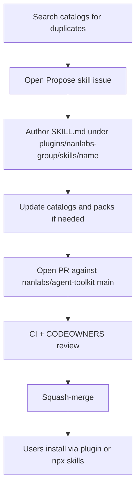

# Add a skill

Anyone can **propose** a skill. Maintainers **approve**. After merge it is installable from this repo.

Canonical: [`docs/CONTRIBUTION.md`](https://github.com/nanlabs/agent-toolkit/blob/main/docs/CONTRIBUTION.md) · layout: [`docs/AUTHORING.md`](https://github.com/nanlabs/agent-toolkit/blob/main/docs/AUTHORING.md) · walkthrough skill: `nanlabs-propose-skill`.



## I have an idea (no code yet)

1. Search [`catalogs/skill-catalog.yaml`](https://github.com/nanlabs/agent-toolkit/blob/main/catalogs/skill-catalog.yaml) and [Skills reference](Skills-Reference) so it is not a duplicate.
2. Open a **[Propose skill](https://github.com/nanlabs/agent-toolkit/issues/new?template=propose-skill.yml)** issue on **nanlabs/agent-toolkit**.
3. Wait for a maintainer pointer (which group plugin, public-safety notes).

Do **not** open the issue against a client repo or `internal-workstation`. This public repository is the source of truth.

## I am writing the skill

Clone this repo (English for commits, PRs, tickets, docs):

```bash
git clone https://github.com/nanlabs/agent-toolkit.git
cd agent-toolkit
```

Put the skill where Agent Plugins discovers it — **immediate** child of the plugin `skills/` directory:

```text
plugins/nanlabs-<group>/
└── skills/
    └── <skill-name>/
        ├── SKILL.md          # required: name + description frontmatter
        ├── references/       # optional
        └── scripts/          # optional
```

Rules that catch most first-time mistakes:

- Directory name must match `name` in `SKILL.md` frontmatter
- Description must say **what** it does and **when** to use it
- No README-only placeholder folders
- No secrets, private URLs, or client data ([`PUBLIC_CONTENT_POLICY.md`](https://github.com/nanlabs/agent-toolkit/blob/main/docs/PUBLIC_CONTENT_POLICY.md))
- Do **not** add a second copy under `skills/<group>/` at repo root
- A **pack** is not a plugin — do not add `plugin.json` for a catalog pack
- After files change, run `python3 scripts/gen-surfaces.py` if catalogs or plugin lists need regenerating

Then follow [Testing](Testing) and [Contributing](Contributing) (`Fixes #N` on the PR).

## Maintainer bar (short)

- Not a duplicate; Cloud users can run it without native subagents
- Handoff documented or N/A ([`docs/HANDOFFS.md`](https://github.com/nanlabs/agent-toolkit/blob/main/docs/HANDOFFS.md))
- Pack membership recorded or N/A
- Validators pass (`validate-skills.py`, `validate-pack-catalog.py`, `validate-no-placeholders.py`, `secret-scan.sh`; `validate-agent-plugins.py` when `plugins/` changes)

Full checklist: [`plugins/nanlabs-ops/skills/nanlabs-propose-skill/references/REVIEW-CHECKLIST.md`](https://github.com/nanlabs/agent-toolkit/blob/main/plugins/nanlabs-ops/skills/nanlabs-propose-skill/references/REVIEW-CHECKLIST.md).

## After merge, how users get it

```bash
npx skills add nanlabs/agent-toolkit@<skill-name>
npx skills add nanlabs/agent-toolkit/plugins/nanlabs-<group>/skills
```

Or update / reinstall the matching **group plugin**.

> [!NOTE]
> Outcome-pack **content** (Delivery Discipline and related) is tracked on existing issues [#24](https://github.com/nanlabs/agent-toolkit/issues/24), [#25](https://github.com/nanlabs/agent-toolkit/issues/25), and [#28](https://github.com/nanlabs/agent-toolkit/issues/28). Update those issues; do not open duplicates.
