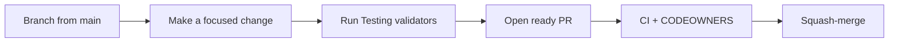

# Contributing

Thanks for contributing to **nanlabs/agent-toolkit**. This repo is public. PRs must stay free of secrets, private URLs, and client data.

Canonical: [`CONTRIBUTING.md`](https://github.com/nanlabs/agent-toolkit/blob/main/CONTRIBUTING.md) · agent contract: [`AGENTS.md`](https://github.com/nanlabs/agent-toolkit/blob/main/AGENTS.md).



## Setup

```bash
git clone https://github.com/nanlabs/agent-toolkit.git
cd agent-toolkit
python3 -m pip install pre-commit
pre-commit install
```

## Pull requests

1. Branch from `main`.
2. Keep the PR focused and link an issue: `Fixes #N` or `Refs #N` (Danger fails without it).
3. Fill the PR template, including the **public-repo** checklist.
4. New or changed skills/agents also fill the Skill/Agent checklist.
5. Open the PR as **ready** (not draft) so Validate actually runs.
6. Prefer squash merges.

English for commits, PR titles, tickets, and docs. Conversation with reviewers can be any language.

## Propose a skill

Follow [Add a skill](Add-a-Skill). Use the **Propose skill** issue template, then the `nanlabs-propose-skill` skill.

## How to test

Full command list and local plugin smokes: [Testing](Testing).

## Wiki source

Edit pages under [`docs/wiki/`](https://github.com/nanlabs/agent-toolkit/tree/main/docs/wiki) in git — **not** the GitHub Wiki UI — so changes stay reviewable.

On push to `main`, [Sync Wiki](https://github.com/nanlabs/agent-toolkit/blob/main/.github/workflows/wiki-sync.yml) copies `*.md` (except this tree’s `README.md`) to [the live wiki](https://github.com/nanlabs/agent-toolkit/wiki).

Generated pages (do not hand-edit): `Plugin-Marketplace.md`, `Skills-Reference.md`, `MCP-Setup.md`. Change YAML catalogs and run `python3 scripts/gen-surfaces.py`.

## Public safety

See [`docs/PUBLIC_CONTENT_POLICY.md`](https://github.com/nanlabs/agent-toolkit/blob/main/docs/PUBLIC_CONTENT_POLICY.md). Code owners: [`.github/CODEOWNERS`](https://github.com/nanlabs/agent-toolkit/blob/main/.github/CODEOWNERS).
