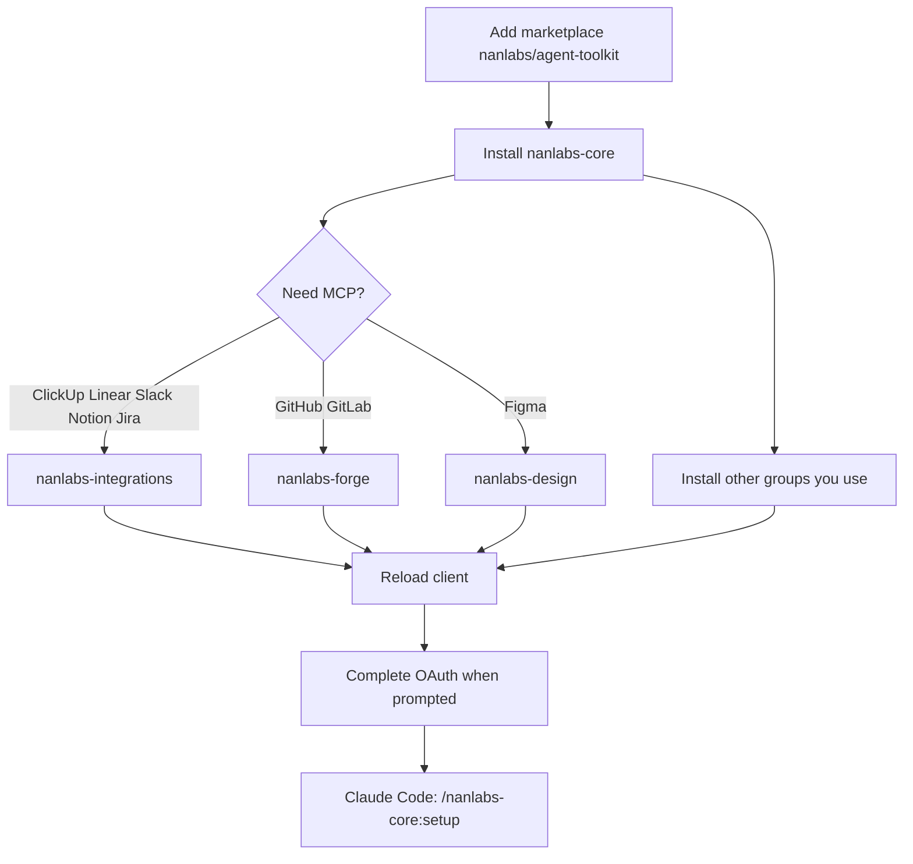

# Installation

Install **group plugins** in your AI client. That is the full product: skills, agents, slash commands, and official MCP.

> [!IMPORTANT]
> Start with **`nanlabs-core`**. Then add the groups you need. Complete copy-paste for every plugin: [Plugin marketplace](Plugin-Marketplace).

Canonical long-form by client: [`docs/ADOPTION.md`](https://github.com/nanlabs/agent-toolkit/blob/main/docs/ADOPTION.md).

## What to install

| Goal | Plugins |
| --- | --- |
| Orchestrator + setup doctor | `nanlabs-core` (required first) |
| Tickets, PRs, GitHub/GitLab | `nanlabs-delivery` + `nanlabs-forge` |
| ClickUp, Slack, Linear, Notion, Jira | `nanlabs-integrations` |
| Figma / UI context | `nanlabs-design` |
| dbt / Snowflake | `nanlabs-data` |
| Client delivery workflow | `nanlabs-workflow` |
| Full agent roster | `nanlabs-agents` (optional) |



## Prerequisites

- **git** (marketplace fetch / clone)
- At least one target client
- Skills-only path: **Node.js** + `npx`
- You do **not** need `internal-workstation` to install from this public repo

## Claude Code

```text
/plugin marketplace add nanlabs/agent-toolkit
/plugin install nanlabs-core@nanlabs-agent-toolkit
/nanlabs-core:setup
```

Then install more groups the same way (`nanlabs-integrations@nanlabs-agent-toolkit`, …). Full block: [Plugin marketplace](Plugin-Marketplace).

## Cursor IDE

Two supported paths:

1. **Team Marketplace** — org admin imports `nanlabs/agent-toolkit`, then you install each `nanlabs-*`.
2. **Local plugins** — clone the repo, symlink each `plugins/nanlabs-*` under `~/.cursor/plugins/local/`, reload the window.

Copy-paste symlinks: [Plugin marketplace](Plugin-Marketplace). Cursor docs: [Cursor plugins](https://cursor.com/docs/plugins).

## GitHub Copilot CLI

```bash
copilot plugin install nanlabs/agent-toolkit:plugins/nanlabs-core
copilot plugin list
```

Repeat for other groups. Full list: [Plugin marketplace](Plugin-Marketplace).

## Cursor Agent CLI

Equal product priority with Cursor IDE. `marketplace add` **registers** the catalog; it does not install a plugin. Load one plugin with `--plugin-dir`.

```bash
agent --version
agent plugin marketplace add https://github.com/nanlabs/agent-toolkit
agent --plugin-dir /path/to/agent-toolkit/plugins/nanlabs-core \
  -p --mode ask --output-format text \
  "List skills and slash commands from the loaded plugin"
```

Matrix: [Cursor Agent CLI](Cursor-Agent-CLI).

## VS Code, Codex, Kiro, and the rest

| Client | How |
| --- | --- |
| VS Code | `"chat.plugins.marketplaces": ["nanlabs/agent-toolkit"]` then install each `nanlabs-*` |
| ChatGPT / Codex | `codex plugin marketplace add nanlabs/agent-toolkit` |
| Kiro | Powers → Import from folder → `plugins/nanlabs-<group>` (not repo root) |
| Grok / Hermes / OpenClaw / NanoClaw | Point at `plugins/nanlabs-<group>/` |

## Skills-only (no plugins, no MCP)

Use this when the client only understands [Agent Skills](https://agentskills.io/specification):

```bash
npx skills add nanlabs/agent-toolkit -g
```

This does **not** install agents, MCP, or `/nanlabs-core:setup`. Packs: [`docs/PACKS.md`](https://github.com/nanlabs/agent-toolkit/blob/main/docs/PACKS.md).

## After install

Continue on [Using the toolkit](Using). To connect hosted MCP, install `nanlabs-design`, `nanlabs-forge`, and/or `nanlabs-integrations`, then complete OAuth — [Official MCP](MCP-Setup).
