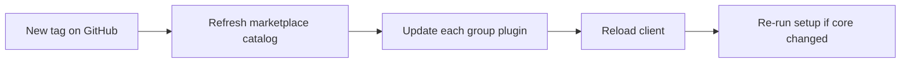

# Updates and rollback

How to refresh plugins after a release, pin a version, or roll back.

Canonical: [`docs/LIFECYCLE.md`](https://github.com/nanlabs/agent-toolkit/blob/main/docs/LIFECYCLE.md) · tags: [`docs/RELEASE.md`](https://github.com/nanlabs/agent-toolkit/blob/main/docs/RELEASE.md).



## Claude Code

| Action | Command |
| --- | --- |
| Refresh catalog | `/plugin marketplace update nanlabs-agent-toolkit` |
| Update plugin | `/plugin update nanlabs-core` (repeat per group) |
| Disable / uninstall | `/plugin disable` · `/plugin uninstall` |
| Pin / rollback | Pin `version` in plugin manifest or marketplace source SHA; then refresh |

## Cursor IDE

Team Marketplace: Refresh / Auto Refresh. Local installs: `git fetch` + checkout the tag, keep the same symlinks, reload the window.

## Cursor Agent CLI

`agent plugin marketplace add` registers a catalog; it does not install a plugin. Use `--plugin-dir` against a **tagged checkout** for local CLI loading.

## GitHub Copilot CLI

```bash
copilot plugin update nanlabs-core
copilot plugin uninstall nanlabs-core
copilot plugin install nanlabs/agent-toolkit:plugins/nanlabs-core
```

Repeat for other groups.

## Skills-only

```bash
npx skills update -g
npx skills remove <skill-name> -g
```

Pin a tag:

```bash
npx skills add nanlabs/agent-toolkit#v0.4.0 -g -y
```

NaNLABS workstations set `NAN_AGENT_TOOLKIT_VERSION` in `~/.config/nanlabs/agent-toolkit.env`.

## After updating

Re-run `/nanlabs-core:setup` if core changed. Re-complete MCP OAuth only if a server URL changed (rare). Then [verify](Using).
